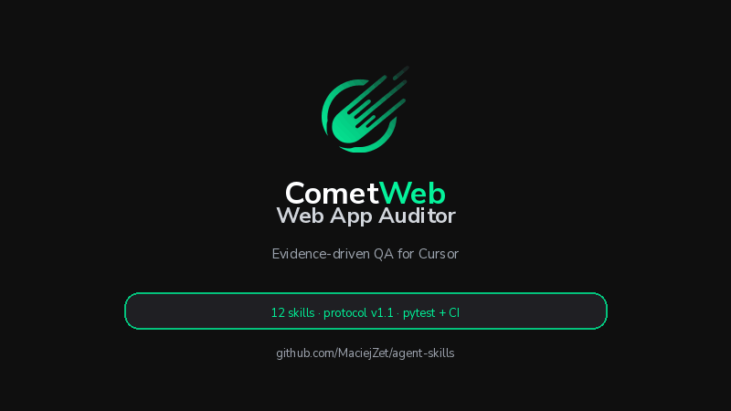

# CometWeb Agent Skills

Twelve standalone skills from [CometWeb Labs](https://cometweb.io), plus **Skill Orchestrator**
for multi-step workflows. Each folder under `skills/` ships a `SKILL.md` entrypoint plus scripts, schemas, and tests where a claim
must hold in code—not only in prose.

[](https://github.com/MaciejZet/agent-skills/actions/workflows/ci.yml)
[](https://github.com/MaciejZet/agent-skills/releases/latest)
[](LICENSE)



## Start here

1. **Install** — [`INSTALL.md`](INSTALL.md): Cursor, Claude Code, or ZIP from [Releases](https://github.com/MaciejZet/agent-skills/releases/latest)
2. **First skill** — `@web-app-auditor` (evidence-backed QA; smallest useful demo)
3. **Questions** — [GitHub Discussions](https://github.com/MaciejZet/agent-skills/discussions)

Sample audit report: [`docs/demo/sample-audit-report.json`](docs/demo/sample-audit-report.json)

## Architecture

Twelve skills that can run alone, but share one evidence and handoff model (CW-AIP v1).
Typical flow:

```text
                         EVIDENCE
                ┌─────────────────────┐
                │ Evidence Researcher │
                └──────────┬──────────┘
                           │
        ┌──────────────────┼──────────────────┐
        │                  │                  │
        ▼                  ▼                  ▼
 Competitive        Product Teardown   Design Partner
 Intelligence                              Finder
        │                  │                  │
        └──────────────────┼──────────────────┘
                           ▼
                    Product Operator
                           │
             ┌─────────────┼─────────────┐
             ▼             ▼             ▼
       Customer Ops  Repo to Roadmap  Specialists
                                      │
                         ┌────────────┴────────────┐
                         ▼                         ▼
                Web App Auditor           SEO / GEO / AEO
                         │
                         └──────────┬──────────────┘
                                    ▼
                          Release Readiness
                                    │
                                    ▼
                              AI Council
                                    │
                                    ▼
                              decision / action

                     AI Humanize → communication layer
```

Real work loops back and branches; the diagram shows default dependencies, not a
single pipeline.

### Evidence before decisions

```text
question → Evidence Researcher → Evidence Pack → specialist / operator / Council → action
```

**Evidence Researcher** builds auditable claim/source/evidence graphs and stops there.
It does not issue GO/NO-GO or product priorities. Downstream skills apply their own
gates to what they accept from an Evidence Pack.

### How invocation works

| Mechanism | What it does |
| --- | --- |
| **`@skill-orchestrator`** | One entry for multi-step flows — plans and runs evidence → Council, audit → release, etc. |
| **Routing rule** (`install-cursor.sh`) | Maps intent from plain chat when you skip `@` tags |
| **Single specialist** | `@web-app-auditor`, `@product-operator`, … when one domain is enough |
| **Evidence Researcher alone** | Evidence Pack only — no GO/NO-GO, no auto-Council |
| **AI Council alone** | Explicit decision — re-verifies evidence even after research |

Example — one tag, full strategic flow:

```text
@skill-orchestrator — Verify our pricing claims, then Council on GO/NO-GO for the new tier.
```

## Skills (13)

| Layer | Skill | Role |
| --- | --- | --- |
| Orchestration | [Skill Orchestrator](skills/skill-orchestrator) | Multi-skill sequences with CW-AIP handoffs; loads each step's SKILL.md in order |
| Evidence | [Evidence Researcher](skills/evidence-researcher) | Atomic claims, source lineage, falsifiers, freshness; Evidence Pack output; no decisions |
| Intelligence | [Competitive Intelligence](skills/competitive-intelligence) | Observation → normalized state → delta → implication; resists headline overreach |
| Intelligence | [Product Teardown](skills/product-teardown) | Transferable patterns from external products; ADOPT requires destination-side evidence |
| Intelligence | [Design Partner Finder](skills/design-partner-finder) | Design partner cohorts and learning contracts—not lead-gen prospecting |
| Product | [Repo to Roadmap](skills/repo-to-roadmap) | Whole-project baseline: topology, gaps, roadmap to a target state |
| Product | [Product Operator](skills/product-operator) | Weekly control loop on existing roadmap/state; lifecycle through Outcome |
| Customer | [Customer Ops](skills/customer-ops) | Support → incident → engineering handoff; closed ticket ≠ verified resolution |
| Quality | [Web App Auditor](skills/web-app-auditor) | Click-through QA with findings, evidence, and a validated report schema |
| Quality | [SEO GEO AEO Maxxing](skills/seo-geo-aeo-maxxing) | Live-verified search and AI-surface visibility audits |
| Release | [Release Readiness](skills/release-readiness) | Pinned RC/build + environment → GO / NO_GO / DEFER; score cannot override gates |
| Decision | [AI Council](skills/ai-council) | Multi-expert material decisions; **explicit invocation only** |
| Writing | [AI Humanize](skills/ai-humanize) | EN/PL prose editing with semantic-fidelity and invariant guards |

### Routing: three skills people confuse

| If the user asks… | Primary skill | Why |
| --- | --- | --- |
| Analyze the whole repo and map the path to a **target state** | **Repo to Roadmap** | Baseline and gap inventory, not a weekly sprint |
| We **already have** a roadmap—what should we do **this week**? | **Product Operator** | Control loop on current state and drift |
| Is **this build/RC** safe to ship to **this environment**? | **Release Readiness** | Requires pinned artifact + environment; gate verdict |

Ambiguous prompts like “analyze the repo for production readiness” are covered in
[`evals/routing/suite.json`](evals/routing/suite.json) (71 cases). Run:

```bash
python3 scripts/run_routing_evals.py
```

Other common routes:

| User intent | Primary skill |
| --- | --- |
| Verify claims → Evidence Pack | **Evidence Researcher** |
| Strategic GO/NO-GO / “przepuść przez Radę” | **AI Council** (explicit) |

## Example invocations

**Product Operator** — weekly reconciliation:

```text
@product-operator — reconcile GitHub + Notion for Insight. What are BLOCKER
and VERIFY NOW items this week?
```

Lifecycle states stay separate: `Intent → Planned → Implemented → Verified → Shipped → Outcome`.
A closed Notion task is not shipped proof.

**Web App Auditor** — bounded QA:

```text
@web-app-auditor — audit cometweb.io/pricing, area mode, standard depth.
```

**Release Readiness** — pinned candidate only:

```text
@release-readiness — RC v1.0.1 build 4821 on staging; run full gate set.
```

**Repo to Roadmap** — first-time or delta baseline:

```text
@repo-to-roadmap — whole-repo baseline for agent-skills; target: public OSS platform.
```

## Install

See **[INSTALL.md](INSTALL.md)** for details.

```bash
git clone https://github.com/MaciejZet/agent-skills.git
cd agent-skills
./scripts/install-cursor.sh          # ~/.cursor/skills + routing rule
./scripts/install-claude.sh          # ~/.claude/skills (Claude Code)
./scripts/install-claude-centrum.sh  # CometWeb centrum .claude/skills
```

Single skill:

```bash
ln -s "$(pwd)/skills/web-app-auditor" ~/.cursor/skills/web-app-auditor
```

**AI Council** optional Notion bindings: copy
`skills/ai-council/references/notion-bindings.example.json` to
`~/.config/cometweb/ai-council-notion.json` (`chmod 600`). See
[`skills/ai-council/references/notion-memory.md`](skills/ai-council/references/notion-memory.md).

## Inter-skill protocol

Handoffs use **CometWeb Agent Interchange Protocol (CW-AIP) v1**:
[`protocol/cw-interchange-v1.md`](protocol/cw-interchange-v1.md) with JSON schemas under
`protocol/schemas/`. Envelope kinds include `EvidenceEnvelope`, `FindingEnvelope`,
`DecisionHandoff`, `SpecialistHandoff`, `ArtifactEnvelope`, and `SnapshotMetadata`.

Example chains the protocol supports:

- Evidence Researcher → Product Operator
- Web App Auditor → Release Readiness
- Competitive Intelligence → AI Council

## Quality and evals

```bash
./scripts/run_all_checks.sh           # safety + validate + routing + pytest + release_check
./scripts/public-safety-check.sh    # no leaked Notion IDs in OSS tree
python3 scripts/validate_skills.py    # metadata + routing suite shape
python3 scripts/run_routing_evals.py  # 71 routing cases
./scripts/run_all_tests.sh            # 332+ unit tests across skills
```

Per-skill tools live under `skills/<name>/scripts/`. Bundle releases:

```bash
./scripts/package-releases.sh v1.0.2
```

See [CHANGELOG.md](CHANGELOG.md) and [CONTRIBUTING.md](CONTRIBUTING.md).

## Compatibility

| Host | Install path |
| --- | --- |
| **Cursor** | `./scripts/install-cursor.sh` |
| **Claude Code** | `./scripts/install-claude.sh` |
| **ChatGPT / Codex / Atlas** | Upload per-skill ZIP from Releases; `agents/openai.yaml` metadata |
| **CometWeb centrum** | `./scripts/install-claude-centrum.sh` |

Implicit invocation is enabled for most skills. **AI Council** requires explicit
invocation for material decisions.

## License

MIT — see [LICENSE](LICENSE). Per-skill licenses in `skills/*/LICENSE`.
[NOTICE](NOTICE) covers private bindings and provenance.

Built alongside [CometWeb Insight](https://cometweb.io).
